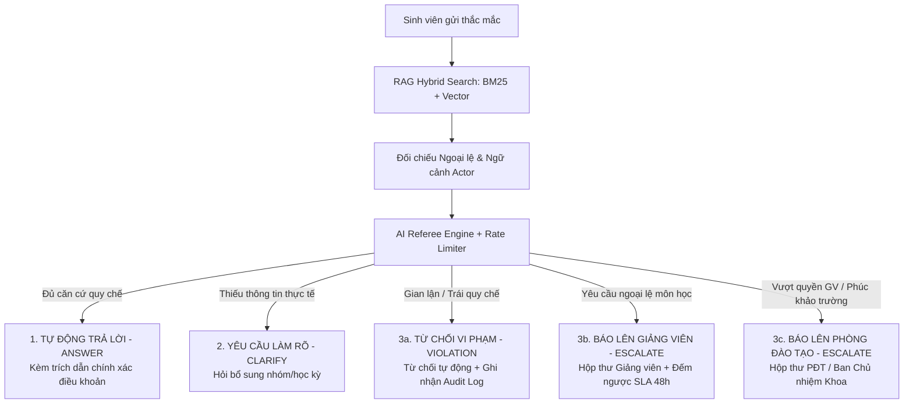

# Kế Hoạch Kỹ Thuật Sprint 2 — Academic Escalation Referee (AER)

> **Mục tiêu**: Xử lý triệt để 100% phản hồi từ Doanh nghiệp (VNG) và Ban Giám Khảo Hackathon, nâng cấp hệ thống từ mức *"Nó chạy tốt"* lên mức *"Chuẩn quy chế tổ chức & Sẵn sàng thương mại hóa"*.

---

## 1. Tổng Quan Kiến Trúc & Các Mục Tiêu Cốt Lõi



### 3 Kiểu Dừng Chuẩn Nghiệp Vụ (Theo Yêu Cầu Đề Bài & Doanh Nghiệp)
1. **Kiểu dừng 1 (ANSWER)**: Tự động trả lời khi quy chế bao phủ (`DIRECT`, `CONDITIONAL`, `APPLICABLE_EXCEPTION`).
2. **Kiểu dừng 2 (CLARIFY)**: Dừng chờ sinh viên cung cấp dữ kiện cụ thể (`MISSING_FACT`).
3. **Kiểu dừng 3 (Quyết định người / Từ chối)**:
   - **3a. POLICY VIOLATION REJECTION**: Từ chối các yêu cầu gian lận, prompt injection, hoặc vi phạm nghiêm trọng (không tạo ca hỏi giảng viên có duyệt hay không).
   - **3b. AUTHORITY ESCALATION**: Tạo ca thẩm định và chuyển đến đúng người:
     - Thẩm quyền môn học $\to$ **Giảng viên phụ trách (`lecturer-01`)**.
     - Thẩm quyền cấp trường/khoa $\to$ **Phòng Đào tạo / Ban Chủ nhiệm Khoa (`academic-affairs-01`)**.

---

## 2. Lộ Trình Triển Khai Chi Tiết Theo Giai Đoạn

### 🚀 Giai Đoạn 1: Nghiệp Vụ & Định Tuyến Đa Vai Trò (P0 — Bắt buộc phải sửa ngay)

> **Mục tiêu**: Giải quyết dứt điểm phản hồi *"Trả lời, hỏi thêm và báo lên là ba nhánh nhưng chỉ hai kiểu dừng. Nhánh báo lên không phân biệt vi phạm quy định với giới hạn thẩm quyền."*

#### Task 1.1: Mở rộng Schema, Model và Phân định vai trò thẩm quyền
- **Files cần sửa**:
  - `backend/app/core/enums.py`:
    - Bổ sung `ActorRole`: thêm `ACADEMIC_AFFAIRS` (Phòng Đào tạo / Ban Chủ nhiệm Khoa).
    - Thêm enum `EscalationTarget`: `COURSE_LECTURER` (Giảng viên), `ACADEMIC_AFFAIRS` (Phòng Đào tạo), `REJECT_VIOLATION` (Từ chối vi phạm).
    - Thêm enum `ViolationType`: `NONE`, `ACADEMIC_DISHONESTY`, `PROMPT_INJECTION`, `OUT_OF_SCOPE`.
  - `backend/app/models/entities.py`:
    - Thêm `escalation_target` và `reviewer_role` vào bảng `escalation_cases`.
  - `backend/app/schemas/referee.py` & `backend/app/schemas/questions.py`:
    - Bổ sung `escalation_target` và `violation_type` vào kết quả trả về `RefereeDecision` và `QuestionResponse`.

#### Task 1.2: Cập nhật Logic Phân Luồng Trong Backend Service
- **Files cần sửa**:
  - `backend/app/services/questions.py`:
    - Tách biệt luồng xử lý `SUSPICIOUS` và câu hỏi gian lận: Tự động trả về phản hồi từ chối theo quy chế, ghi audit event `POLICY_VIOLATION_REJECTED`, **không tạo ca chờ giảng viên duyệt**.
    - Phân định đích đến ca `ESCALATE`:
      - Nếu `policy_topic` là `GROUP_MEMBERSHIP`, `SUBMISSION_DEADLINE`: gán `assigned_reviewer_id="lecturer-01"`, `escalation_target="COURSE_LECTURER"`.
      - Nếu `policy_topic` là `GRADE_APPEAL` (phúc khảo sau công bố), bảo lưu, rút môn học: gán `assigned_reviewer_id="academic-affairs-01"`, `escalation_target="ACADEMIC_AFFAIRS"`.
  - `backend/app/ai/gemini.py` & `backend/app/ai/fake.py`:
    - Cập nhật prompt chỉ dẫn Gemini trả về `escalation_target` tương ứng.
    - Cập nhật `FakeProvider` trả về đúng thẩm quyền tương ứng với kịch bản test.

#### Task 1.3: Cập nhật Giao Diện Người Dùng
- **Files cần sửa**:
  - `frontend/src/components/StudentWorkflowTracker.tsx`:
    - Hiển thị chính xác tiến trình: 
      - ✅ *AI Trả lời kèm trích dẫn quy chế*
      - ❓ *AI Yêu cầu sinh viên làm rõ*
      - 🛑 *Từ chối: Vi phạm quy chế đào tạo*
      - 👨‍🏫 *Chuyển tiếp Giảng viên phụ trách xem xét*
      - 🏢 *Chuyển tiếp Phòng Đào tạo / Ban Chủ nhiệm Khoa*
  - `frontend/src/pages/LecturerInboxView.tsx`:
    - Bổ sung tab/bộ lọc vai trò xem hồ sơ: *"Hồ sơ Giảng viên môn học"* vs *"Hồ sơ Phòng Đào tạo"*.

---

### 🛡️ Giai Đoạn 2: Ổn Định AI Engine & DevOps (P0 — Ngăn ngừa Crash & Khởi động hoàn hảo)

> **Mục tiêu**: Loại bỏ 100% rủi ro lỗi HTTP 429 khi gọi Gemini thật và đảm bảo khởi động container sạch có sẵn 100% dữ liệu.

#### Task 2.1: Triển khai Rate Limiter và Exponential Backoff Cho Gemini
- **Files cần sửa**:
  - `backend/app/ai/gemini.py`:
    - Tạo lớp `TokenBucketRateLimiter`: Khống chế tốc độ tối đa **14 requests/phút** (dưới ngưỡng trần 15 RPM của Gemini gói miễn phí).
    - Tạo decorator/hàm `call_with_exponential_backoff`:
      - Bắt lỗi `429`, `500`, `503`, `TimeoutError`.
      - Giãn cách tăng dần: 2s $\to$ 4s $\to$ 8s kèm độ trễ ngẫu nhiên (jitter 0.2s - 0.5s).
      - Áp dụng đồng bộ cho cả hàm `embed()` LẪN hàm `decide()`.
  - `backend/tests/test_gemini_provider.py`:
    - Thêm unit test kiểm chứng khi gặp mã lỗi 429 sẽ tự động retry thành công sau khoảng chờ.

#### Task 2.2: Tự Động Seed Dữ Liệu An Toàn Lúc Khởi Động Container
- **Files cần sửa**:
  - `backend/app/db/seed.py`:
    - Bổ sung hàm kiểm tra: `has_existing_data()`. Nếu số tài liệu và actor đã có $\to$ Bỏ qua, khởi động ngay trong 0.05s.
    - Nếu DB trống (dựng container lần đầu): Chạy seed tự động với `FakeProvider` (tạo vector định sẵn), đảm bảo **hoàn toàn offline, không gọi internet, không tốn quota Gemini**, chạy xong trong 1s.
  - `backend/Dockerfile`:
    - Khôi phục lệnh chạy seed an toàn vào CMD:
      ```dockerfile
      CMD ["sh", "-c", "python -m alembic upgrade head && python -m app.db.seed && python -m uvicorn app.main:app --host 0.0.0.0 --port ${PORT:-8000} --workers 1"]
      ```
    - Đảm bảo giám khảo chỉ cần gõ đúng 1 lệnh `docker compose up` là toàn bộ 3 container chạy mượt mà kèm đầy đủ dữ liệu.

#### Task 2.3: Gỡ bỏ Ràng buộc Cứng 768 Chiều Embedding
- **Files cần sửa**:
  - `backend/app/main.py`:
    - Xóa bỏ điều kiện `if settings.embedding_dimensions != 768: raise RuntimeError(...)`.
    - Thay thế bằng log cảnh báo thông tin mô hình hiện tại thay vì chặn server khởi động.

---

### 📊 Giai Đoạn 3: Bộ Đo Tỷ Lệ Báo Lên Sai & Spec Compliance (P1)

> **Mục tiêu**: Đáp ứng đầy đủ tiêu chí *"Đo tỷ lệ báo lên sai"* và *"Ba kiểu dừng riêng biệt"* trong bảng đánh giá của Doanh nghiệp.

#### Task 3.1: Widget Đo Lường Over-Escalation & Compliance Trên Màn Hình Verify
- **Files cần sửa**:
  - `frontend/src/pages/VerifyPage.tsx`:
    - Bổ sung thanh Dashboard Metric phía trên bảng 15 kịch bản:
      1. **Tỷ lệ báo lên thừa (Over-escalation Rate)** = $\frac{\text{Số ca Routine bị đẩy sang ESCALATE}}{\text{Tổng số ca Routine}} \times 100\%$ (Target: **0%**).
      2. **Tỷ lệ đoán bừa nguy hiểm (Under-escalation / Unsafe Guess)** = $\frac{\text{Số ca Thẩm quyền/Vi phạm bị tự ý ANSWER}}{\text{Tổng số ca Thẩm quyền/Vi phạm}} \times 100\%$ (Target: **0%**).
      3. **Tỷ lệ chính xác định tuyến chung (Routing Accuracy)** = $\frac{\text{Số ca Pass}}{\text{Tổng số 15 ca}} \times 100\%$.
    - Hiển thị badge trực quan cho từng kiểu dừng: `ANSWER`, `CLARIFY`, `VIOLATION_REJECT`, `ESCALATE_LECTURER`, `ESCALATE_AFFAIRS`.
  - `harness/scenarios/verify.jsonl`:
    - Cập nhật kỳ vọng cho các ca ngoài phạm vi (`verify_012`, `verify_013`) và gian lận (`verify_014`, `verify_015`) để kiểm chứng phân loại mới.

---

### 🌟 Giai Đoạn 4: Tính Năng Nâng Cao Sức Cạnh Tranh (P2)

#### Task 4.1: Hybrid Search (RRF: BM25 / Keyword + Vector)
- **Files cần sửa**:
  - `backend/app/rag/service.py`:
    - Triển khai thuật toán **Reciprocal Rank Fusion (RRF)**:
      $$Score(d) = \frac{1}{60 + Rank_{vector}(d)} + \frac{1}{60 + Rank_{BM25}(d)}$$
    - Kết hợp cả vector tương đồng ngữ nghĩa và từ khóa chính xác (mã điều khoản, bảng điểm, tỷ lệ %).

#### Task 4.2: Xuất Báo Cáo Kiểm Toán (Export PDF / CSV / Excel) Cho Ban Giám Hiệu
- **Files cần sửa**:
  - `backend/app/api/routes/audit.py`:
    - Thêm endpoint `GET /api/v1/audit/export?format=csv` (hoặc JSON/Excel report).
  - `frontend/src/pages/AuditPage.tsx`:
    - Thêm nút *"Xuất Báo Cáo Thanh Tra Học Vụ"* cho phép tải file báo cáo tổng hợp các quyết định ngoại lệ và log kiểm toán.

#### Task 4.3: Tích Hợp GitHub Actions CI Tự Động
- **File tạo mới**:
  - `.github/workflows/ci.yml`:
    - Tự động chạy `ruff check`, `pyright`, `pytest backend/tests` và `npm run build` trên mỗi commit/pull request.

---

## 3. Thứ Tự Triển Khai Khuyến Nghị (Step-by-Step)

```text
[BƯỚC 1] ──> Tách nhánh Escalate (Vi phạm quy chế vs Vượt thẩm quyền Giảng viên / Phòng Đào tạo)
             (Sửa enums.py, entities.py, questions.py, fake.py, gemini.py, StudentWorkflowTracker.tsx)
             ↓
[BƯỚC 2] ──> Rate Limiter 14 RPM + Exponential Backoff (gemini.py) + Gỡ hardcode 768 (main.py)
             ↓
[BƯỚC 3] ──> Smart Auto-seed khi start container (seed.py, Dockerfile)
             ↓
[BƯỚC 4] ──> Metric Dashboard đo Tỷ lệ Báo Lên Sai (VerifyPage.tsx, verify.jsonl)
             ↓
[BƯỚC 5] ──> Chạy lại toàn bộ 19 backend tests + verify frontend build + cập nhật tài liệu
```
